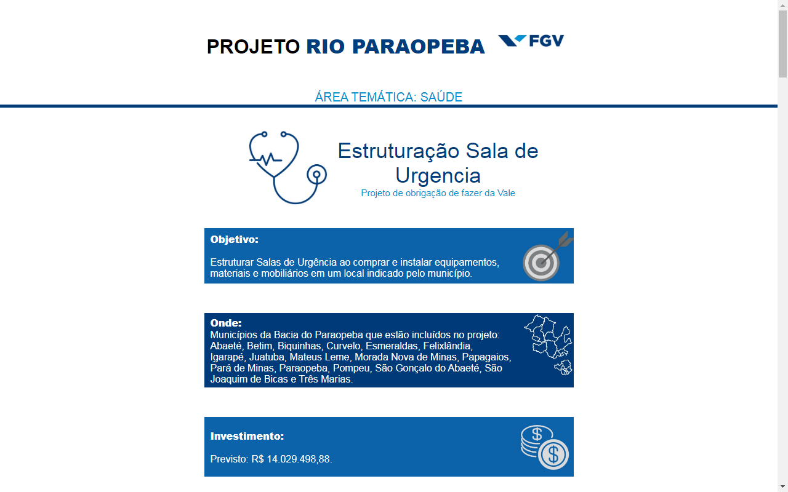
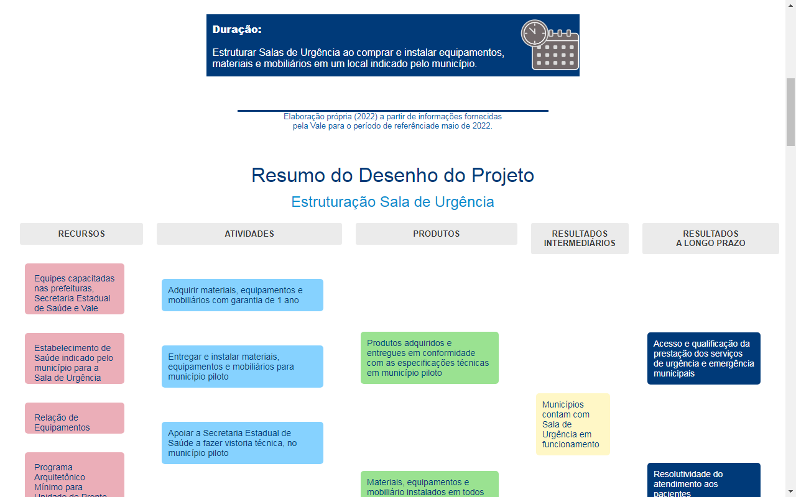
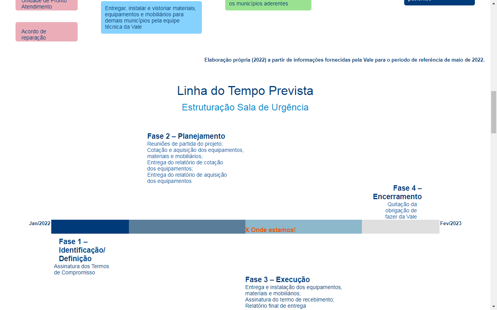
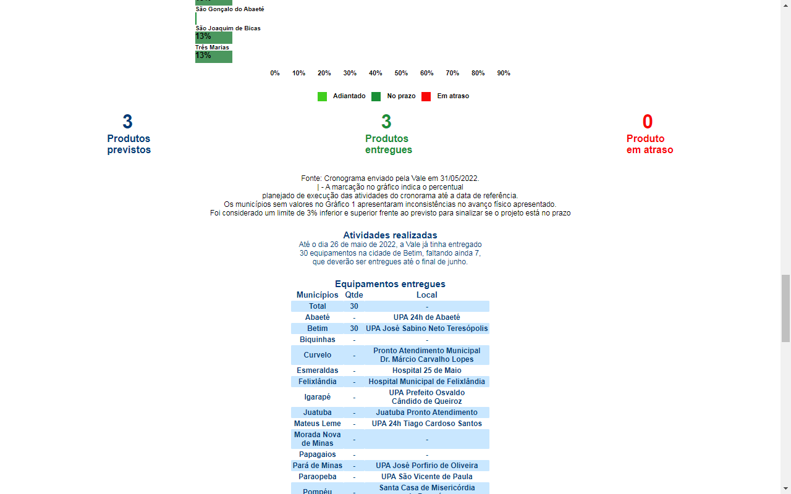
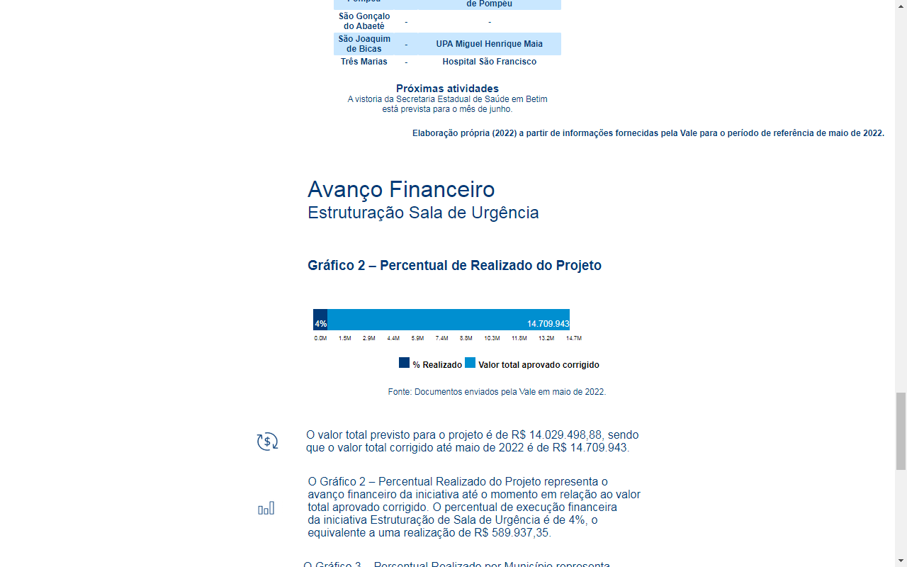
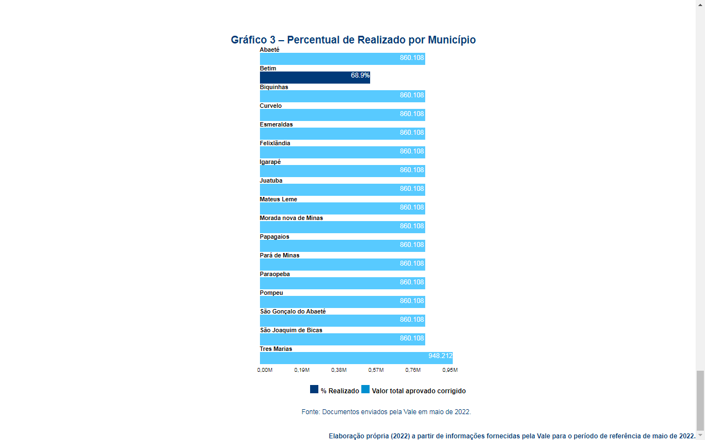

<h1 align='center'>Projeto Brumadinho</h1>

 

<a href='https://evanilsonpg.github.io/Projeto-de-Brumadinho/'>Clique aqui e veja o Projeto--></a>

 

<h2 align='center'>Descrição</h2> 

**Projeto** criado criado recendo uma demanda de projeto da empresa FGV onde entreguei esse projeto antes do prazo estipulado.

 

<h2 align='center'>Sobre</h2>

Projeto totalmente responsivo, usando as tecnologias Html, Css & JavaScript.
 
 

### **Tecnologias usadas** ->
 

- [HTML]()
- [CSS]()
- [JAVASCRIPT]()
